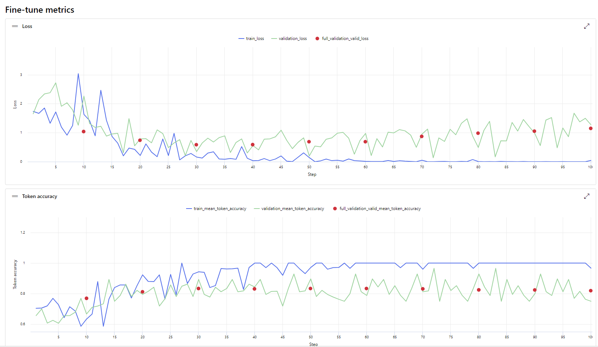

## Fine Tuning Metrics

The image shows metrics from a fine-tuning process for a machine learning model, specifically focusing on two aspects: **Loss** and **Token Accuracy** over several training steps.
### 1. Loss Plot:

- **Train Loss (blue line)**: Represents the loss on the training dataset. A decreasing trend generally indicates that the model is learning from the training data.

- **Validation Loss (green line)**: Represents the loss on the validation dataset. It is used to assess how well the model generalizes to unseen data. Ideally, the validation loss should also decrease as the model learns.

- **Full Validation Loss (red dots)**: Represents checkpoints where the model is evaluated on the full validation set, giving a comprehensive assessment of its performance.

### Interpretation:

- In the **Loss** plot, both the training and validation losses decrease over time, which is a positive sign indicating the model is learning effectively. However, the fluctuation in validation loss suggests there might be some overfitting or variability in performance on the validation data, especially as training progresses.

### 2. Token Accuracy Plot:

- **Train Mean Token Accuracy (blue line)**: Indicates the average token-level accuracy on the training data. A higher value means the model is predicting tokens correctly more often.

- **Validation Mean Token Accuracy (green line)**: Represents token accuracy on the validation set, providing insight into the model's generalization ability.

- **Full Validation Mean Token Accuracy (red dots)**: Reflects the token accuracy when the model is evaluated on the entire validation set.

### Interpretation:

- In the **Token Accuracy** plot, we see that the training token accuracy is generally stable and slightly increasing, suggesting consistent learning. The validation token accuracy, while fluctuating, also shows a general upward trend, indicating improving performance on the validation data.

### Overall:

- The graphs suggest that the model is learning and improving its performance over time. However, the fluctuations in validation metrics (both loss and accuracy) indicate there could be room for further tuning, possibly by adjusting hyperparameters like batch size, learning rate, number of epochs to mitigate overfitting. Consistently monitoring these metrics is crucial for ensuring the model's robustness and generalization to new data.

In fine-tuning machine learning models, the batch size and learning rate multiplier are two critical hyperparameters that significantly impact the training process. The batch size determines the number of training examples processed in one forward and backward pass through the neural network. Smaller batch sizes result in more frequent updates to the model parameters, which can improve generalization but also increase training time due to more frequent updates. Larger batch sizes allow for faster training through greater parallelism but may require higher learning rates to avoid slower convergence.

The learning rate multiplier adjusts the base learning rate during fine-tuning, influencing how much the model weights change in response to each update. A higher learning rate multiplier increases the learning rate, leading to faster convergence but with the risk of overshooting the optimal solution and causing the model to diverge. Conversely, a lower learning rate multiplier decreases the learning rate, allowing for more precise adjustments to the model weights, which helps prevent divergence but can slow down the training process. Choosing the right batch size and learning rate multiplier is essential for achieving optimal model performance and often requires experimentation.

